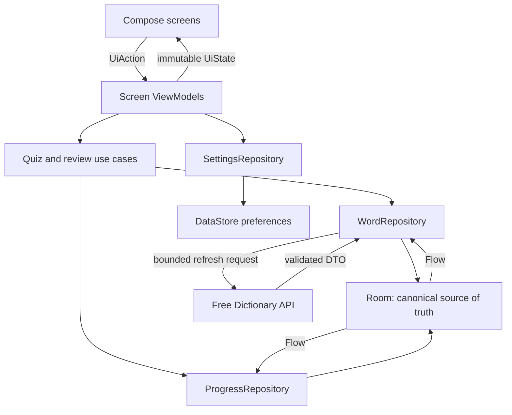

# LexiDue

> An offline-first academic vocabulary trainer for first-year university students aged 18-24 who use English as an additional language.

**Status:** M1 complete - Foundation and navigation (2026-07-20)

**Course:** JCU CP3406 Assessment 3

**Platform:** Android, Kotlin, Jetpack Compose, Material Design 3

LexiDue now has its M1 application foundation: the final namespace, Hilt entry points, adaptive type-safe navigation, four reachable Compose screen foundations, accessible shared components, a secure network boundary, backup exclusions, automated checks, and CI. The learning engine, Room data model, API enrichment, persistent settings, and live statistics remain planned for M2 and later milestones.

## Product vision

Many new university students can recognise academic words while reading but struggle to recall their meaning, distinguish similar definitions, or use the words confidently. LexiDue will turn a curated academic vocabulary deck into short retrieval-practice sessions with immediate feedback, delayed retry, spaced review, and local progress statistics.

The app is deliberately narrower than a general dictionary. Its purpose is to help learners practise a controlled set of useful academic words, identify items that need review, and build durable recall without accounts, advertising, social comparison, or time pressure.

## Target learners and learning outcomes

**Primary audience:** first-year university students aged 18-24 who use English as an additional language.

The MVP will help a learner:

- recall the meaning of a curated academic word;
- identify the correct word from a definition;
- distinguish plausible but incorrect definitions;
- recognise the word's part of speech and optional phonetic form;
- revisit due words and other words selected for review through a transparent schedule; and
- use local statistics to choose the next useful practice session.

## Core learning loop

1. The learner starts a 5-, 10-, or 15-word session from the Home screen.
2. The app selects due words and other words marked for review from Room, falling back to the curated starter deck.
3. The Activity screen presents one cued-retrieval question at a time.
4. The learner receives immediate text feedback and a short explanation.
5. An incorrect word is re-queued after at least two different questions, avoiding instant memorisation of the previous answer.
6. Every answer is saved atomically; the Statistics screen updates from the local database.
7. Correct answers advance the word through review intervals of 1, 3, 7, 14, and 30 days. An incorrect answer returns it to the first interval.

Skip and Exit are never scored as incorrect. Inactivity does not remove mastery or trigger negative feedback, and due dates are recommendations rather than penalties.

The MVP will use two scored question modes with seedable generation:

- **Definition to word:** select the word that matches a definition.
- **Word to definition:** select the correct meaning for a word.

Difficulty changes distractor quality rather than adding time pressure: Foundation uses three clearly distinct choices, Standard uses four part-of-speech-compatible choices, and Challenge uses four more semantically similar choices. All modes remain untimed.

Typed recall, cloze questions, and pronunciation audio are stretch goals. They will not delay the required four-screen app.

## Core screen plan

| Required screen | Learner goal | Planned content and behaviour | Acceptance evidence |
| --- | --- | --- | --- |
| **Home / Landing** | Understand what to practise and start quickly | App purpose, due/review word count, session-length selector, difficulty selector, start button, explicit **Enrich deck** action (maximum five due words), compact progress summary, saved-content/last-refresh status, and navigation to Statistics and Settings | A learner can start a valid session in two actions; a marker can visibly demonstrate API request -> validation -> Room -> cached reuse; loading, empty, cached-content, and refresh-failure states are recoverable |
| **Activity** | Complete a focused learning session | One question at a time, progress indicator, large answer targets, immediate correct/incorrect feedback with icon and text, definition/part of speech, optional phonetics, delayed retry, pause/exit, and end-of-session summary | A session works from cached data, records every answer, survives configuration changes, and never relies on colour alone |
| **Statistics** | Understand progress and choose the next practice focus | Total sessions, overall accuracy, mastered/due counts, review-box distribution, words to review, and recent sessions; every chart also has a text summary | Results persist after restart, update immediately after a session, and remain understandable with TalkBack or without colour |
| **Settings** | Control the experience and local data | Session length, difficulty, theme, sound/haptics, reduced motion, privacy/API information, and a confirmed reset/delete action | Preferences persist, the core activity still works when optional effects are disabled, and reset removes local learning history |

### Navigation plan

- `Home` is the start destination.
- `Statistics` and `Settings` are top-level destinations.
- `Practice(sessionId)` and `PracticeSummary(sessionId)` form a nested activity flow launched from Home.
- A Material 3 `NavigationSuiteScaffold` uses a navigation bar on compact widths and a navigation rail on expanded widths; the practice flow hides top-level navigation to preserve focus.
- Destinations use serializable route types rather than manual route strings.
- Starting a session creates its identifier before navigation. `SavedStateHandle` restores only `sessionId`; the ViewModel reconstructs the authoritative question order, attempts, and progress from Room.
- Back from an unanswered session asks whether to leave; recorded answers remain saved. Back from the summary returns to Home without duplicating destinations.

## Scope

### MVP

- Four complete Compose screens with Material 3 styling.
- Typed Navigation Compose destinations and tested back-stack behaviour.
- A curated starter deck and two multiple-choice question modes.
- A visible, learner-triggered Free Dictionary API enrichment flow with bounded cache refresh.
- Room persistence for dictionary content, sessions, attempts, and review progress.
- DataStore persistence for user preferences.
- Offline practice from local data after first-run seed import.
- Clear loading, content, empty, stale-cache, cached fallback, and refresh-failure states.
- Model, repository, ViewModel, Room, Compose UI, and navigation tests.
- Privacy, accessibility, and ethical-design checks described below.

### Stretch goals

- Pronunciation playback when the API supplies audio, always with a text/phonetic alternative.
- User-directed word lookup and a reviewed custom deck.
- Cloze questions only when a safe, unambiguous example sentence is available.
- Richer progress visualisations and deep links.

### Explicitly out of scope

- Accounts, profiles, a custom backend, or cloud progress sync.
- Advertising, analytics, leaderboards, social sharing, or competitive ranking.
- Chat, user-generated public content, or unreviewed feeds.
- Speech recognition, microphone use, OCR, camera/location/storage access, or media upload.
- Push notifications, coercive streaks, countdown pressure, loot-box rewards, or guilt-based copy.
- Premature multi-module architecture; one app module with clear feature packages is sufficient.

## Planned architecture

LexiDue will use a single-activity, layered MVVM architecture with feature-grouped UI and unidirectional data flow. Screen-level ViewModels expose immutable `StateFlow<UiState>` values and accept explicit UI actions. Composables render state and never call an API, DAO, or DataStore directly.



### Planned package structure

```text
com.cailiangzhe.lexidue
|-- app/                 # Application, MainActivity, top-level app state
|-- navigation/          # Serializable destinations and NavHost
|-- core/
|   |-- common/          # TimeProvider, random provider, result/error types
|   |-- designsystem/    # Theme tokens and reusable accessible components
|   `-- model/           # Shared domain models
|-- data/
|   |-- local/           # Room entities, DAOs, database, migrations
|   |-- remote/          # API DTOs, service, response validation, mappers
|   |-- preferences/     # DataStore settings
|   `-- repository/      # Offline-first repository implementations
|-- domain/
|   |-- repository/      # Repository contracts
|   `-- usecase/         # Session generation, scoring, review scheduling
|-- feature/
|   |-- home/
|   |-- practice/
|   |-- statistics/
|   `-- settings/
`-- di/                  # Hilt modules
```

### Planned Android components

- **UI:** Jetpack Compose and Material Design 3.
- **Navigation:** Navigation Compose with serializable, type-safe destinations.
- **State:** ViewModel, coroutines, `StateFlow`, immutable UI state, and lifecycle-aware collection.
- **Dependency injection:** Hilt with constructor-injected repositories, DAOs, API service, minSdk-compatible `TimeProvider`, and random provider.
- **Networking:** Retrofit/OkHttp with Kotlin serialization and explicit DTO-to-domain mapping.
- **Persistence:** Room as the canonical source of truth and DataStore for simple preferences.
- **Code quality:** Spotless with ktlint plus Android Lint; both run locally and in CI.
- **Background work:** not required for the MVP; refresh remains learner-initiated and transparent.

## API and offline-first data plan

The planned external source is the key-free [Free Dictionary API](https://dictionaryapi.dev/), using:

```text
GET https://api.dictionaryapi.dev/api/v2/entries/en/{word}
```

The API can provide definitions, parts of speech, phonetics, examples, synonyms, antonyms, and optional pronunciation audio. LexiDue will request only curated English words in the MVP. The application payload contains the lookup word only; it never contains answers, scores, identifiers, settings, or progress. As with any internet request, the provider can still receive ordinary connection metadata such as the device IP address and User-Agent. The app will disclose the provider before refresh and will not log request URLs or bodies in release builds.

Room is the canonical source for learning content and progress read by the UI:

1. A small planned starter deck with original plain-language canonical meanings and recorded reference sources is imported into Room on first run.
2. The UI observes Room immediately and remains usable without a connection.
3. The Home screen's **Enrich deck** action refreshes at most five due words per tap and never bulk-fetches the full deck. Cached enrichment becomes stale after 30 days but is not refreshed automatically.
4. Fetched senses, examples, synonyms, and audio metadata are stored separately from canonical quiz meanings. In the MVP they may enrich feedback, but they never silently replace an answer key or enter the distractor pool.
5. A timeout, 404, malformed payload, or response without any usable definition produces `Refresh failed - saved content shown`. Missing examples, phonetics, or audio simply hide those optional UI elements.
6. The UI shows the provider, content source, refresh progress/result, and last successful refresh time. Enrichment remains visible from Room after restart with networking unavailable.

Before API-derived definitions or audio are cached in a release build, their response-data, caching, attribution, and secondary-host terms must be recorded in `docs/decision-log.md`. If those terms are unsuitable or unclear, the repository interface allows the source to be replaced; server-code licensing alone will not be treated as permission to redistribute returned content.

No tests will depend on the live API. MockWebServer fixtures will verify Retrofit/serialization and HTTP failure mapping; fake repositories/DAOs will keep repository and ViewModel tests deterministic.

### Planned Room model

| Entity | Minimum stored fields | Purpose |
| --- | --- | --- |
| `WordEntity` | normalized key such as `en:analyse`, display spelling, deck/source metadata | Stable word identity; the remote API supplies no database ID |
| `CanonicalMeaningEntity` | local stable ID, word key, part of speech, original definition, reference/provenance | Reviewed local meaning used for question answers and distractors |
| `ApiSenseEntity` | local stable ID/hash, word key, part of speech, definition, optional example/phonetic/audio URL, source, fetched timestamp | Quarantined cached enrichment, separate from the scored quiz pool |
| `ReviewProgressEntity` | word ID, review box, correct/incorrect counts, next review timestamp | Transparent spaced-review state |
| `SessionEntity` | local UUID, difficulty, random seed, planned word count, status (`ACTIVE`, `COMPLETED`, `ABANDONED`), correct count, start time, nullable end time | Session lifecycle; delayed retries do not change the planned word count |
| `SessionQuestionEntity` | local UUID, session ID, sequence, word key, question type, stored option IDs, optional retry-of ID | Reconstructs the exact active session after process death |
| `AttemptEntity` | local UUID, unique question-instance ID, session ID, outcome (`CORRECT`, `INCORRECT`, `SKIPPED`), retry flag, answer timestamp | Idempotent answer record; uniqueness prevents double-tap/recomposition double counting |

Planned Room evidence includes foreign keys and indices, word/meaning/enrichment relations, a session/questions/attempts relation, transactional answer/progress updates, and `Flow` aggregate queries. Database migrations will be explicit; destructive migration fallback will not be used for the submitted app.

Statistics use objective definitions: **due** means `nextReviewAt <= TimeProvider.now`; **mastered** means review box 5; **words to review** means at least two graded attempts plus accuracy below 60%, or an incorrect most-recent graded attempt. `SKIPPED` outcomes are excluded from accuracy and mastery calculations.

DataStore will contain only preferences such as session length, difficulty, theme, sound/haptics, reduced motion, and onboarding state. Relational learning progress will not be duplicated in DataStore.

## Ethical and professional design commitments

### Privacy and data minimisation

- No account, real name, email, advertising ID, analytics, location, contacts, or device identifier.
- The only Android platform permission requested by the app is `android.permission.INTERNET`; it has no runtime prompt. AndroidX also generates and uses the app-scoped `com.cailiangzhe.lexidue.DYNAMIC_RECEIVER_NOT_EXPORTED_PERMISSION`, a `signature`-level custom permission that protects non-exported dynamic receivers. It is not a platform data-access permission and cannot be granted to an app signed with another key.
- API traffic uses HTTPS with cleartext traffic disabled. Any future permission requires a dated justification, just-in-time explanation, safe denial path, and README update.
- Learning history stays on the device and is never uploaded.
- A clear reset action deletes attempts, sessions, and review progress after confirmation.
- The M1 privacy baseline sets `android:allowBackup=false`, references a legacy `full-backup-content` rule and Android 12+ `data-extraction-rules`, and excludes every supported storage domain from both cloud backup and device transfer. The release merged manifest was verified before progress data is introduced. Future M2+ storage must remain covered by these rules; history will remain until Reset or uninstall and will not be restored through Android backup or device transfer.
- Keys, tokens, local configuration, and generated files remain excluded from Git.

### Safe and age-appropriate learning design

- Automatic practice uses only a curated academic word allow-list.
- Content licences and attribution are recorded before definitions or examples are bundled or cached for release.
- Fetched content is not automatically trusted: empty, malformed, excessively long, unsuitable, mismatched-part-of-speech, or unapproved-sense fields are rejected or kept out of the quiz pool.
- Feedback is calm and specific: it explains the answer without shame or exaggerated celebration.
- Mastery and due-review information replace streak-loss pressure and social comparison.
- Sessions are untimed by default; learners may pause, skip, retry, change difficulty, or stop.
- Skip/Exit never lowers a score or mastery value, and review reminders are neutral recommendations.
- Rewards never block content, hide progress, or use variable-reward mechanics.

### Accessibility and inclusion

- Meaningful TalkBack labels, headings, roles, state descriptions, and logical focus order.
- Minimum 48 dp interactive targets and sufficient spacing.
- Support for large text, including a 200% font-scale check with no clipping.
- Contrast targets of at least 4.5:1 for normal text and 3:1 for large text and essential UI graphics; correctness is communicated with icon, text, and colour together.
- Text summaries for every progress chart.
- Polite live-region announcements for answer feedback and network errors, with focus restored after question changes and dialogs.
- Visible, logical focus for keyboard, D-pad, and Switch Access interaction.
- Pronunciation audio is optional and always paired with phonetic/text information.
- Audio never auto-plays; playback occurs only after a learner action and may contact the separate host provided by the API response.
- Reduced-motion and sound/haptic controls; core learning never depends on animation or audio.
- Responsive layouts checked on compact and expanded widths, portrait and landscape.
- Plain English instructions and no accent-based scoring.

## Testing strategy

| Layer | Planned checks | Evidence |
| --- | --- | --- |
| Pure model/use-case tests | scoring, unique distractors, delayed retry, 1/3/7/14/30-day schedule, mastery calculation, empty deck, injected `TimeProvider` and seeded random provider | Fast JVM tests with deterministic inputs |
| HTTP/mapping tests | Retrofit success, 404, malformed JSON, timeout/IOException mapping, optional-field omission, protocol-relative audio URL normalisation to HTTPS | MockWebServer and versioned response fixtures |
| Repository tests | cache hit, explicit bounded refresh, 30-day staleness, saved-content fallback, content quarantine, atomic answer update | Fake API/DAO and repository state assertions |
| ViewModel tests | loading/content/empty/cached/refresh-failure transitions and every important UI action | Coroutine test dispatcher and fake repositories |
| Room tests | relations, indices, transactions, cascade behaviour, due/review queries, statistics aggregates, migration when schema changes | In-memory database instrumented tests |
| Compose UI tests | four screen states, answer feedback, settings persistence, reset confirmation, semantics and large targets | Android instrumented tests |
| Navigation tests | Home to Practice to Summary to Statistics, back behaviour, session argument restoration | Type-safe destination assertions |
| Manual accessibility/responsive pass | TalkBack order and announcements, focus restoration, keyboard/D-pad/Switch Access focus, 200% font, measurable contrast, colour-independent feedback, reduced motion, phone/tablet, portrait/landscape | Final checklist and screenshot matrix |

Quality commands (the first command is also the CI verification gate):

```bash
./gradlew spotlessCheck testDebugUnitTest lintDebug
./gradlew connectedDebugAndroidTest  # requires a running emulator/device
```

Windows PowerShell:

```powershell
.\gradlew.bat spotlessCheck testDebugUnitTest lintDebug
.\gradlew.bat connectedDebugAndroidTest  # requires a running emulator/device
```

## Rubric-to-evidence plan

| Criterion | Weight | Planned excellent-band evidence |
| --- | ---: | --- |
| General code quality | 10% | Layered packages with feature-grouped UI, clear Kotlin naming, small single-purpose classes/composables, decision-focused comments, no sample/dead code, Spotless/ktlint and Android Lint checks |
| Design and UI | 10% | Material 3 tokens/components, complete loading/empty/offline/error/content states, responsive layouts, accessibility checklist, final screenshots |
| Navigation | 15% | One tested NavHost, serializable destinations, nested Practice/Summary flow, state restoration, correct back-stack behaviour |
| App architecture | 15% | Single-activity MVVM/UDF, immutable UI state, ViewModels, Hilt, repository contracts, use cases, Room source of truth, no API/DAO calls from UI |
| Advanced API features | 20% | Dictionary API mapping plus visible error handling; Room relations, transactions, aggregate Flow queries, restart-safe progress, and offline cache demonstration |
| Unit testing | 10% | Model and data unit tests plus Room, ViewModel, Compose GUI, and navigation tests covering success, failure, and offline paths |
| GitHub and version control | 10% | Small rubric-aligned commits, milestone issues/checklists, evolving README, no secrets/generated files, green checks on `main`, screenshots and test evidence |
| Self-reflection | 10% | Dated decision evidence linking Assessment 2 ethics and ACS principles to implementation, verification, trade-offs, and all six Gibbs stages |

## Development milestones

- [x] **M0 - Repository baseline and plan**
  - Android Studio Compose scaffold, GitHub repository, rubric-aligned README, and passing baseline unit task.

- [x] **M1 - Foundation and navigation**
  - Rename namespace/application ID and source/test packages to `com.cailiangzhe.lexidue`.
  - Add version-catalog entries for Kotlin serialization, KSP, Hilt, Navigation Compose, lifecycle Compose, Room, DataStore, Retrofit/serialization/OkHttp, coroutine testing, Room testing, Compose testing, MockWebServer, and Spotless/ktlint.
  - Define theme tokens, Hilt setup, feature contracts, serializable routes, adaptive top-level navigation, four screen foundations, the backup/network-security baseline, and `.github/workflows/android-ci.yml`.
  - Gate passed on 2026-07-20: Home, Practice, Statistics, and Settings are reachable; system Back returns from Practice to Home; instrumentation verifies heading semantics, a minimum 48 dp action target, and Home at 200% font scale.
  - Verification passed: CI is configured to run `spotlessCheck`, `testDebugUnitTest`, and `lintDebug`; four connected instrumentation tests passed; the release merged manifest has `android:usesCleartextTraffic=false` and `android:allowBackup=false`, and references both backup-rule files. The only requested Android platform permission is `INTERNET`; the additional AndroidX permission is the app-scoped signature permission explained in the privacy section.

- [ ] **M2 - Local learning vertical slice**
  - Canonical starter-deck importer, core Room word/session tables, repository contracts, seedable question generator, distractors, scoring, delayed retry, review scheduling, Practice UI, summary state, and model/ViewModel tests.
  - Gate: a complete local session records idempotent attempts/progress, reconstructs from Room, and passes model/ViewModel tests with basic accessibility checks.

- [ ] **M3 - API enrichment and offline-first persistence**
  - Dictionary API service, terms/licence decision, MockWebServer fixtures, validation/mappers, quarantined `ApiSenseEntity` cache, bounded five-word refresh, 30-day staleness, full Room relations/DAOs, session reconstruction, repository states, and DataStore settings.
  - Gate: the Home enrichment path visibly performs network -> validation -> Room; saved enrichment remains visible after restart with networking unavailable; refresh failures keep canonical content usable; HTTP/data/repository tests pass.

- [ ] **M4 - Statistics, settings, and privacy controls**
  - Room aggregate queries, Statistics UI, settings persistence, privacy/API disclosure, and verified local reset.
  - Gate: statistics update immediately and survive restart; reset removes learning history while preserving safe defaults; new UI includes semantics, large targets, and dynamic-text checks.

- [ ] **M5 - UI, accessibility, and resilience polish**
  - Adaptive layouts, all screen states, TalkBack semantics/announcements/focus restoration, large text, measurable theme contrast, keyboard/D-pad/Switch Access focus, reduced motion, and usability review.
  - Gate: manual accessibility/responsive checklist and critical Compose tests pass.

- [ ] **M6 - Verification, documentation, and submission**
  - Full tests/lint, screenshots, architecture and data evidence, known limitations, README update, release build, project ZIP, and Gibbs reflection PDF.
  - Gate: a fresh clone builds, required checks pass, repository access is shared with teaching staff, and submission artifacts are ready.

## Git and documentation workflow

- Keep `main` reproducible and commit after each coherent piece of progress.
- Use focused commit messages, for example:
  - `feat(navigation): add typed app destinations`
  - `feat(data): cache dictionary entries in Room`
  - `test(practice): cover review scheduling and retry`
  - `docs(readme): add implemented screenshots and results`
- Avoid one large final code dump; the history should demonstrate continuous development.
- Update this README at every milestone so planned claims become implemented evidence.
- Add final screenshots only after the corresponding screen is functional.
- Update `docs/decision-log.md` at every milestone for architecture, API/content limitations, privacy, accessibility, autonomy, failed alternatives, feelings, and usability feedback.

## Gibbs reflection evidence plan

Development notes will record:

1. the exact Assessment 2 ethical issue and relevant ACS principle;
2. the initial assumption and contemporaneous feeling/reaction;
3. alternatives considered and the technical/design decision made;
4. the relevant implementation commit;
5. the verification result, screenshot, test, or usability observation;
6. what worked, what failed, and the limitation/trade-off; and
7. the next action.

Minimum evidence includes the merged-manifest and backup audit, reset test, API data-flow/content-review record, accessibility matrix, and safe persuasive-copy decision.

The final approximately 1000-word reflection will explicitly cover Description, Feelings, Evaluation, Analysis, Conclusion, and Action Plan rather than only summarising features.

## Definition of done

The assessment build is complete when:

- all four required screens are functional and reachable through modern navigation;
- a learner can complete a session using refreshed or cached content;
- every answer persists and statistics update correctly after restart;
- API loading, empty, 404, malformed, timeout, and offline paths are visible and recoverable;
- privacy reset deletes local learning history and backup behaviour is intentional;
- phone/tablet, portrait/landscape, TalkBack, 200% font, contrast, and colour-independent feedback checks pass;
- model and GUI test suites plus lint pass;
- the README contains implemented screenshots, architecture, API attribution, privacy decisions, test evidence, and known limitations;
- Git history shows regular focused commits rather than a single final upload; and
- the Gibbs reflection uses concrete development and ethics evidence.

## Current project configuration

The repository currently uses:

- Android Gradle Plugin 9.2.1 with its built-in Kotlin integration;
- Kotlin Compose/serialization plugins 2.2.10, KSP 2.3.9, and Hilt 2.59.2;
- Java 17 source/bytecode compatibility and Kotlin JVM target 17;
- Jetpack Compose with the Compose BOM and Material 3 adaptive navigation suite;
- Navigation Compose 2.9.8 with serializable type-safe routes;
- `minSdk` 24, `targetSdk` 36, and compile SDK 36.1;
- Gradle daemon/toolchain JDK 21 (Android Studio's bundled JBR is suitable);
- Hilt application/activity entry points and an injectable Retrofit/OkHttp/serialization `NetworkModule` foundation;
- Home, Practice, Statistics, and Settings screen contracts and accessible Compose foundations; and
- Spotless/ktlint, JUnit, Compose UI, navigation, and Android instrumentation test support.

M1 deliberately stops at the application foundation. The screen states are currently in-memory examples; ViewModels, Room, DataStore repositories, dictionary calls, session logic, and real statistics are M2+ work.

## Getting started

1. Clone the repository.
2. Open it in Android Studio.
3. Select Android Studio's bundled JBR 21 as the Gradle JDK, then allow Gradle to sync and install the required Android SDK components.
4. Run the `app` configuration on an emulator or Android device.
5. Run the same formatting, JVM-test, and lint gate used by CI:

```bash
./gradlew --no-daemon spotlessCheck testDebugUnitTest lintDebug
```

6. With an emulator running or a device connected, run the navigation, identity, and accessibility instrumentation tests:

```bash
./gradlew connectedDebugAndroidTest
```

Windows PowerShell uses `.\gradlew.bat --no-daemon spotlessCheck testDebugUnitTest lintDebug` and `.\gradlew.bat connectedDebugAndroidTest`. If a standalone terminal cannot find Java, set `JAVA_HOME` to the Android Studio `jbr` directory for that terminal session. The connected test task requires a running emulator or connected device and is intentionally separate from the current host-only GitHub Actions job.

`local.properties`, signing credentials, environment files, document-review artifacts, and generated build outputs are intentionally excluded from version control.

## Key risks and mitigations

| Risk | Mitigation |
| --- | --- |
| Dictionary API unavailable or incomplete | Ship an original canonical starter deck, read from Room first, retain cached enrichment, expose refresh-failure/saved-content state, and never depend on live API in tests |
| API response or audio rights are unclear | Record terms, caching rights, attribution, and secondary hosts before M3; replace the source behind `WordRepository` if release use cannot be justified |
| Missing or ambiguous meanings/examples | Keep API senses outside the scored pool, use one canonical local meaning per question, generate distractors from compatible parts of speech, and skip unsafe questions |
| Distractor or review logic becomes nondeterministic | Inject `TimeProvider` and a seeded random provider; use invariant checks such as unique answer options |
| Scope grows beyond the schedule | Protect the four screens, two quiz modes, API/Room, architecture, and tests; defer audio, custom decks, charts, and deep links |
| Accessibility is left until the end | Build shared accessible components early and add semantics, large-text, contrast, and screen-state checks in each milestone |
| README overstates implementation | Keep the status section current and change planned statements only when evidence exists |

## Technical references

- [Free Dictionary API](https://dictionaryapi.dev/)
- [Android architecture recommendations](https://developer.android.com/topic/architecture/recommendations)
- [Android offline-first guidance](https://developer.android.com/topic/architecture/data-layer/offline-first)
- [Type-safe Navigation Compose routes](https://developer.android.com/guide/navigation/design/type-safety)
